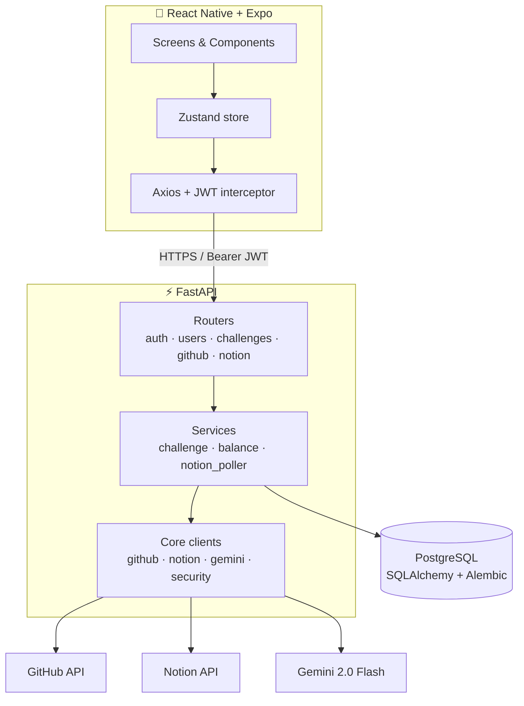
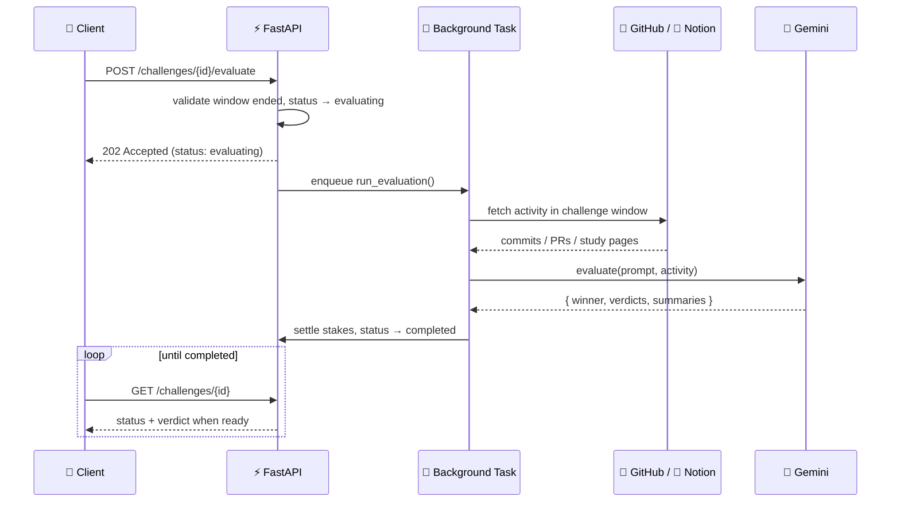
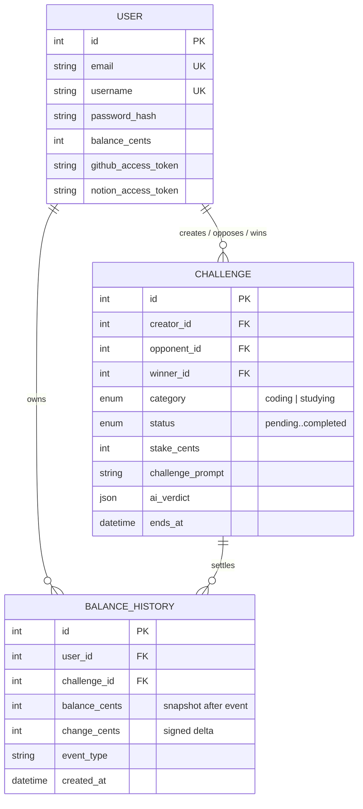

<div align="center">

# 🏆 Rival

### Put your money where your goals are.

**Rival is a 1v1 productivity-betting app where two people stake real money on measurable goals — and an AI referee, backed by live data from GitHub and Notion, decides who wins.**

[](https://www.python.org/)
[](https://fastapi.tiangolo.com/)
[](https://reactnative.dev/)
[](https://expo.dev/)
[](https://www.postgresql.org/)
[](https://www.typescriptlang.org/)
[](https://ai.google.dev/)

[**Demo on Devpost**](https://devpost.com/software/1170625) · [Architecture](#-architecture) · [API Reference](#-api-reference) · [Getting Started](#-getting-started)

</div>

---

## 📖 Overview

Most productivity apps rely on streaks and badges — extrinsic motivation that fades. Rival adds the one incentive that doesn't: **money on the line, head-to-head against a real opponent.**

Two players agree on a goal ("Make 5+ meaningful commits in 24h", "Finish 3 chapters of organic chemistry"), each stake an equal amount ($1–$500), and the clock starts. When time's up, Rival doesn't ask anyone to self-report. Instead it pulls **real activity signals** — commits, PRs, and issues from the **GitHub API**, or edited pages and study notes from the **Notion API** — and hands them to an **AI referee** that produces an auditable verdict with per-player reasoning. The winner takes the pot.

> **Note on scope:** This is a working full-stack prototype. Stake settlement runs against an internal wallet ledger; real-money rails (Stripe) and the platform commission are intentionally stubbed and documented as such — see [Design Decisions](#-design-decisions).

---

## ✨ Features

| | |
|---|---|
| 🎯 **Head-to-head challenges** | Invite a specific user or create an open challenge. Full lifecycle state machine: `pending → active → evaluating → completed`, plus `declined` / `cancelled` with automatic stake refunds. |
| 🤖 **AI referee** | Google **Gemini 2.0 Flash** evaluates outcomes from real activity data and returns structured JSON: a winner, a per-player verdict, and human-readable summaries. Prompts enforce topic-relevance and quality-over-quantity. |
| 🐙 **GitHub integration** | OAuth connect, then fetch commits, pull requests, and issues within the challenge window to judge coding challenges. |
| 📝 **Notion integration** | OAuth connect a workspace, pick a study page, and Rival recursively crawls child pages to measure real study activity. |
| 💰 **Wallet & ledger** | Every balance change is recorded in an append-only `balance_history` ledger (event-sourcing-lite) that stays in lockstep with the user's balance. |
| 📊 **Stats & charts** | Win rate, streaks, lifetime earnings, and an interactive balance-over-time chart (1D / 1W / 1M / 6M / 1Y / ALL). |
| 🔄 **Live progress** | A background asyncio loop refreshes active studying challenges every 2 minutes so progress is current without user action. |
| 🔐 **Secure auth** | JWT (7-day) sessions, bcrypt-hashed passwords, OAuth tokens stored server-side, secrets kept in the device keychain via `expo-secure-store`. |

---

## 🧱 Tech Stack

| Layer | Technologies |
|-------|-------------|
| **Mobile** | React Native 0.81 · Expo 54 · Expo Router (file-based routing) · TypeScript 5.9 |
| **State** | Zustand · Axios (with auth interceptor) |
| **Backend** | FastAPI 0.115 · Uvicorn · Pydantic v2 · Python 3.12 |
| **Database** | PostgreSQL · SQLAlchemy 2.0 ORM · Alembic migrations |
| **AI** | Google Gemini 2.0 Flash (`google-generativeai`) |
| **Integrations** | GitHub OAuth + REST · Notion OAuth + API · `httpx` async client |
| **Security / Infra** | PyJWT · bcrypt · `slowapi` rate limiting · CORS middleware |

---

## 🏗 Architecture

Rival is a **mobile client + REST API + Postgres** system with a clean separation between transport (routers), business logic (services), and external clients (core).



### The AI evaluation flow

Evaluation can take many seconds (multiple third-party fetches + an LLM call), so it never blocks an HTTP request. The API uses an **async kickoff + poll** pattern with a dedicated `evaluating` state, making the long-running job durable and the endpoint safe to retry.



### Data model



---

## 🧠 Design Decisions

A few choices that keep the system correct, auditable, and honest about its scope:

- **Thin routers, thick services.** Routers only parse/validate requests and shape responses; all state transitions, money math, and AI orchestration live in `backend/app/services/`. This keeps endpoints trivial and business logic unit-testable in isolation.
- **Async evaluation, never a 60-second request.** `POST /challenges/{id}/evaluate` flips the challenge to `evaluating`, returns `202` immediately, and runs the work in a FastAPI background task. The endpoint is **idempotent** (re-calling mid-evaluation is a no-op) and **rate-limited** to 5/min per IP via `slowapi`.
- **Money lives in an append-only ledger.** Every credit or debit flows through a single `balance_service.apply_balance_change`, which updates `users.balance_cents` and writes a `balance_history` row in the same transaction. Balances are always reconstructible and auditable — there's no path that mutates a balance without a paper trail.
- **AI output is structured, not prose.** The referee returns strict JSON (`winner`, per-player verdict, summaries), so the result is machine-actionable for settlement and renderable as a clean verdict card. Prompts mandate topic-relevance to defend against off-topic gaming.
- **OAuth that works on mobile.** GitHub uses a direct deep-link callback (`rival://auth/github`); Notion (which requires a fixed HTTPS redirect) uses a **backend relay** that smuggles the app's deep link through the OAuth `state` parameter and bounces the user back into the app.
- **Honest stubs.** Wallet top-ups (`POST /users/me/balance`) credit the account directly for demo purposes, capped per call. In production this would be replaced by a Stripe payment-intent webhook before crediting — and the platform commission applied at settlement. These boundaries are documented rather than hidden.

---

## 📁 Project Structure

```
rival/
├── backend/                        # FastAPI service
│   ├── app/
│   │   ├── main.py                 # App factory, CORS, lifespan (starts pollers)
│   │   ├── routers/                # HTTP layer — auth, users, challenges, github, notion
│   │   ├── services/               # Business logic — challenge, balance, notion_poller
│   │   ├── models/                 # SQLAlchemy models — user, challenge, balance_history
│   │   ├── schemas/                # Pydantic request/response contracts
│   │   └── core/                   # config, database, security, github, notion, gemini, rate_limit
│   ├── alembic/                    # Versioned DB migrations
│   └── requirements.txt
│
├── frontend/                       # React Native + Expo app
│   ├── app/                        # expo-router routes
│   │   ├── _layout.tsx             # Root layout + auth guard
│   │   ├── login.tsx
│   │   ├── (tabs)/                 # Dashboard · History · Profile
│   │   ├── challenge/              # create · [id] detail · pending
│   │   └── auth/github.tsx         # OAuth deep-link handler
│   ├── components/                 # Charts, cards, sliders, pickers, animations
│   └── lib/                        # api · auth · storage · theme · types · config
│
└── docs/                           # Codebase walkthrough & technical notes
```

---

## 🔌 API Reference

Base URL: `http://localhost:8000` · Interactive docs at `/docs` (Swagger) and `/redoc`.

<details>
<summary><b>Auth & Users</b></summary>

| Method | Endpoint | Description |
|--------|----------|-------------|
| `POST` | `/api/auth/register` | Create an account |
| `POST` | `/api/auth/login` | Log in (OAuth2 form) → JWT |
| `GET` | `/api/users/me` | Current user |
| `POST` | `/api/users/search` | Find opponents by username |
| `GET` | `/api/users/me/stats` | Wins, losses, earnings, streak, win rate |
| `GET` | `/api/users/me/balance-history` | Time-series for the balance chart |
| `POST` | `/api/users/me/balance` | Demo wallet top-up |

</details>

<details>
<summary><b>Challenges</b></summary>

| Method | Endpoint | Description |
|--------|----------|-------------|
| `POST` | `/api/challenges` | Create a challenge (debits creator's stake) |
| `GET` | `/api/challenges` · `/pending` · `/active` | List views |
| `GET` | `/api/challenges/{id}` | Detail (auto-refreshes progress) |
| `POST` | `/api/challenges/{id}/accept` | Accept (debits opponent) |
| `POST` | `/api/challenges/{id}/decline` · `/cancel` | Cancel with stake refund |
| `POST` | `/api/challenges/{id}/refresh` | Force a progress refresh |
| `POST` | `/api/challenges/{id}/evaluate` | Kick off async AI evaluation (`202`) |

</details>

<details>
<summary><b>Integrations</b></summary>

| Method | Endpoint | Description |
|--------|----------|-------------|
| `GET` | `/api/github/oauth-url` · `/status` | GitHub OAuth + connection status |
| `POST` `DELETE` | `/api/github/connect` · `/disconnect` | Manage GitHub link |
| `GET` | `/api/github/commits` | Commit count within a window |
| `GET` | `/api/notion/oauth-url` · `/callback` · `/status` | Notion OAuth relay + status |
| `POST` `DELETE` | `/api/notion/connect` · `/disconnect` | Manage Notion link |
| `GET` | `/api/notion/pages` | Search workspace pages |

</details>

---

## 🚀 Getting Started

### Prerequisites

- Python 3.12+ · Node.js 18+ · PostgreSQL 14+
- A Google **Gemini API key**, and OAuth apps for **GitHub** and **Notion**

### 1. Backend

```bash
cd backend
python -m venv venv && source venv/bin/activate
pip install -r requirements.txt

createdb rival
alembic upgrade head

uvicorn app.main:app --reload --host 0.0.0.0 --port 8000
```

Create `backend/.env`:

```ini
DATABASE_URL=postgresql://localhost/rival
SECRET_KEY=change-me-to-a-long-random-string

GEMINI_API_KEY=your-gemini-key

GITHUB_CLIENT_ID=...
GITHUB_CLIENT_SECRET=...
GITHUB_REDIRECT_URI=rival://auth/github

NOTION_CLIENT_ID=...
NOTION_CLIENT_SECRET=...
NOTION_REDIRECT_URI=http://localhost:8000/api/notion/callback
```

### 2. Frontend

```bash
cd frontend
npm install

# On a physical device or simulator, Expo must reach your machine's LAN IP,
# not localhost. On macOS: ipconfig getifaddr en0
export EXPO_PUBLIC_BACKEND_URL=http://192.168.1.42:8000

npx expo start
```

Scan the QR code with **Expo Go**, or press `i` / `a` for the iOS / Android simulator.

---

## 🗺 Roadmap

- [ ] Stripe payment intents for real-money deposits & withdrawals
- [ ] WebSocket push for instant verdict delivery (replacing client polling)
- [ ] Pytest suite + GitHub Actions CI
- [ ] Containerized local stack (Docker Compose)
- [ ] Structured logging + error monitoring (Sentry)
- [ ] Push notifications for invites, results, and deadlines

---

## 👤 Author

**Suraj Kumar** — full-stack engineer

If you're a recruiter or fellow engineer, the [`docs/`](docs/) folder includes a guided codebase walkthrough and a write-up of the technical decisions above.
</content>
</invoke>
